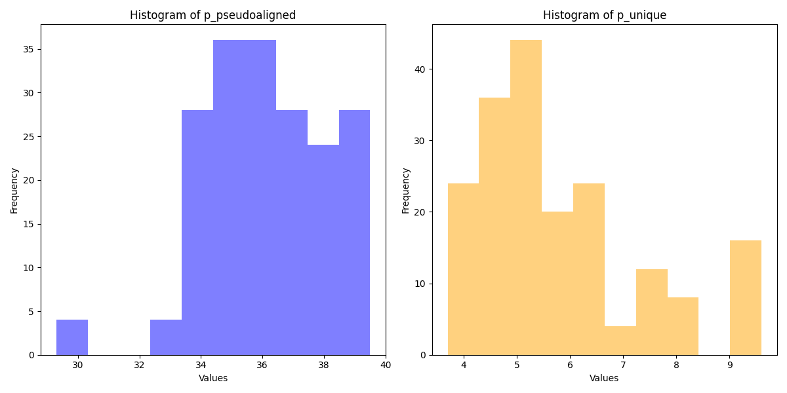

### Anndata file output

AnnData object with n_obs × n_vars = 1023204 × 70711
- obs: 'Comment[ENA_SAMPLE]', 'Comment[BioSD_SAMPLE]', 'Characteristics[organism]', 'Characteristics[age]', 'Characteristics[developmental stage]', 'Characteristics[sex]', 'Characteristics[individual]', 'Characteristics[organism part]', 'Characteristics[disease]', 'Characteristics[genotype]', 'Material Type', 'Description', 'Protocol REF', 'Protocol REF.1', 'Protocol REF.2', 'Extract Name', 'Comment[LIBRARY_LAYOUT]', 'Comment[LIBRARY_SELECTION]', 'Comment[LIBRARY_SOURCE]', 'Comment[LIBRARY_STRATEGY]', 'Comment[ORIENTATION]', 'Comment[input molecule]', 'Comment[library construction]', 'Comment[primer]', 'Comment[single cell isolation]', 'Comment[spike in]', 'Comment[cdna read]', 'Comment[cdna read offset]', 'Comment[cdna read size]', 'Comment[cell barcode offset]', 'Comment[cell barcode read]', 'Comment[cell barcode size]', 'Comment[umi barcode offset]', 'Comment[umi barcode read]', 'Comment[umi barcode size]', 'Comment[sample barcode offset]', 'Comment[sample barcode read]', 'Comment[sample barcode size]', 'Protocol REF.3', 'Performer', 'Assay Name', 'Technology Type', 'Comment[ENA_EXPERIMENT]', 'Comment[ENA_RUN]', 'Factor Value[organism part]'
- layers: 'mature', 'nascent'